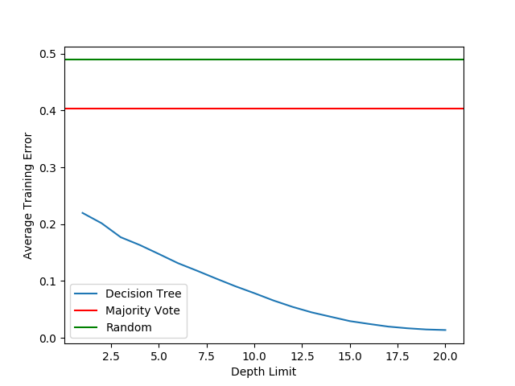

# Titantic Decision Tree

This project was part of the first problem set of the Intro to Machine Learning class (CS M146) I took at UCLA. I ported the code to Python 3 and made some slight changes to clean up the program.

## Summary and Findings

To begin, I created some histograms to visualize the data. From the graphs, I was able to make a few key observations:

- More than half of the upper class survived, about half of the middle class survived, and about a quarter of the lower class survived
- About 75% of the females survived, whereas only 20% of the males survived
- About 60% of those younger than the age of 10 survived, and about 40% of those under 20 survived. Those in the age groups 20-50 were not prioritized as much as the children and teens were

I then created a baseline (Random Classifier) classifier that predicts a target class based on the distribution of classes in the training set, and compared the training and testing error of a Random/Majority Classifier to that of a Decision Tree classifier. From this, I easily saw how much more powerful and accurate a Decision Tree classifier is compared to a Random/Majority Classifier.

I explored the decision tree's vulnerability to overfitting training data by using cross-validation, testing the depth limits of the decision tree. It was clear that after a certain depth limit, the decision tree began to overfit, as evidenced by the increased testing error.

From my results, I concluded that a depth limit of 6 is best for this data set.

Using the previously determined depth limit of 6, I varied the amount of training and testing data by starting with splits of 0.05 (5% is training data) and working up to splits of 0.95 (95% is training data), and observed the average testing error for the Majority/Random Classifier and the Decision Tree Classifier. As I expected, the more training data we got, the lower the average testing error was. This means as as we fed our Decision Tree more training data, it became more accurate in predicting the correct outcome.